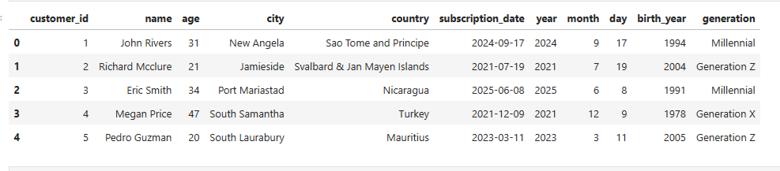
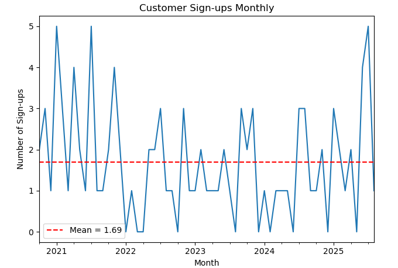
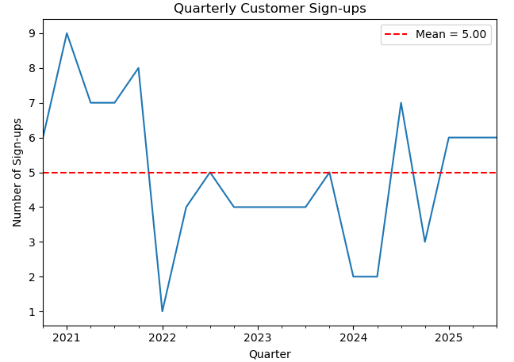
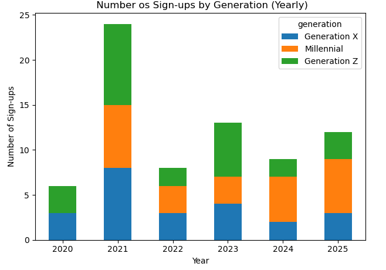

🌍 GlobeStream Customer Sign-Ups Analysis (2020–2025)

GlobeStream is a global SaaS company offering cloud-based productivity tools to small businesses.
Since launching in early 2020, the company has expanded rapidly across more than 60 countries — but its customer data quality and insight lagged behind growth.

This project focuses on cleaning, enriching, and analysing customer subscription data so that GlobeStream’s marketing team can make data-driven targeting and growth decisions.

🧩 Business Problem

The original dataset (customers.csv) contained 100 customer records, each representing a subscription between January 2020 and September 2025.

However, the data had multiple issues:

Inconsistent subscription_date formats

Missing or invalid dates (outside the valid business timeline)

No customer age segmentation

No visibility into how customer sign-ups evolved over time

As a result, management could not confidently answer:

When did customers actually join?

Which periods saw growth or decline?

Which customer age groups are driving sign-ups?

🛠️ Approach & Methodology

The analysis followed a clear, structured workflow:

Exploratory Data Analysis (EDA)

Data cleaning and validation

Feature engineering (time & demographic features)

Trend analysis using visualisations

Customer segmentation for marketing insights

Export of a cleaned, reusable dataset

🔍 Data Cleaning & Feature Engineering

The subscription_date column was standardised and validated to ensure all dates fell within the correct business window (2020–2025).

From this cleaned date, the following features were extracted:

Year

Month

Day

Quarter

Birth year

Customer generation (Generation X, Millennial, Generation Z)

This transformed the dataset from raw records into a marketing-ready analytical asset.

✅ Example of the cleaned dataset

This enriched dataset is saved as customers_cleaned.csv and can be reused for future reporting or campaign analysis.

### Cleaned Dataset Preview

The dataset was cleaned, validated, and enriched with time-based and demographic features
(year, month, quarter, birth year, and customer generation).

📈 Customer Sign-Ups Over Time (Monthly)

To understand short-term fluctuations and overall momentum, customer sign-ups were aggregated monthly.

Insights:

Monthly sign-ups show natural volatility, typical of SaaS subscription behaviour.

The red dashed line represents the average monthly sign-ups, providing a baseline.

Several months exceed the mean, indicating periodic spikes likely driven by campaigns or external factors.

This view helps marketing teams identify seasonality and campaign timing opportunities.

### Customer Sign-ups (Monthly)

Monthly aggregation highlights short-term fluctuations in customer acquisition.
The dashed red line represents the average monthly sign-ups, providing a useful baseline.

📊 Customer Sign-Ups Over Time (Quarterly)

To reduce noise and highlight broader trends, sign-ups were also analysed at a quarterly level.

Insights:

Quarterly aggregation reveals clear growth and slowdown phases.

Early post-launch periods show stronger acquisition.

Later periods stabilise, suggesting GlobeStream moved from rapid expansion to more sustainable growth.

This view is useful for strategic planning and quarterly performance reviews.

### Customer Sign-ups (Quarterly)

Quarterly aggregation smooths out monthly volatility and reveals broader growth patterns
across the post-launch and post-pandemic periods.

🎯 Customer Segmentation by Generation

To support targeted marketing, customers were segmented into generational cohorts based on birth year:

Generation X

Millennials

Generation Z

Insights:

Millennials and Generation Z dominate sign-ups in recent years.

Generation Z shows increasing participation, signalling long-term growth potential.

Generation X remains present but contributes fewer new sign-ups.

Marketing Implication:

This segmentation enables GlobeStream to:

Tailor messaging toward younger, digitally native users

Allocate campaign budgets more efficiently

Design onboarding experiences aligned with dominant age groups

### Customer Sign-ups by Generation

Customers were grouped into generational cohorts (Generation X, Millennial, Generation Z)
to help the marketing team understand **which age groups are driving growth**.

This segmentation allows GlobeStream to tailor messaging, onboarding, and campaign spend
toward the most active customer generations.

📦 Project Outputs

Cleaned dataset: customers_cleaned.csv

Time-based and demographic features

Visual insights for decision-making

Reusable analysis structure

👤 Author

Muhammed Uwais Adam
Data Analysis | Python | Feature Engineering | Business Insights
